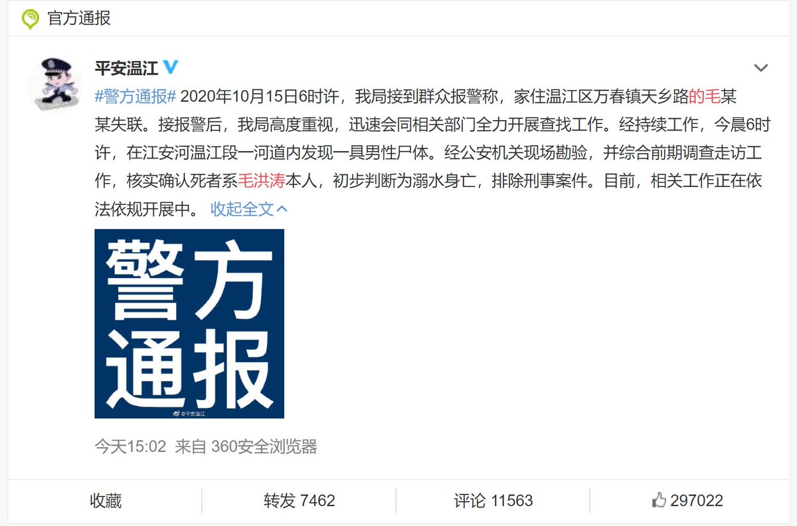

# 毛洪涛

## 简介

男，中国共产党党员，成都大学二级教授，博士生导师，2019年起任该校党委书记。
[wiki链接](https://zh.wikipedia.org/wiki/%E6%AF%9B%E6%B4%AA%E6%B6%9B) 

2005年任西南财经大学教务处处长兼教务党总支书记（正处级），主持教学体制改革
2010年，2013年任西南财经大学研究生院常务副院长（省属本科高校行政副职）
2014年任西南财经大学中国管理会计研究中心主任、四川旅游学院副院长
2016年任眉山市副市长，主要负责发展改革、对外开放
2018年任中共眉山市委常委、宣传部部长
2019年3月1日，被中共成都市委任命为成都大学党委书记

## 事件资料

2020年10月14日晚，毛洪涛执意出门，被妻子拦住。次日清晨5时左右出门，并在微信朋友圈写下遗书

其中，毛洪涛对成都大学校长**王清远**提出指控，称王清远
**“营私舞弊、中饱私囊”**
**“建立利益集团和独立王国”**
**“连续挤压三任党委书记”**

当天上午，成都市公安局龙泉驿分局十陵派出所接到来自成都大学的报警，称毛洪涛失联。
10月16日凌晨6时，毛洪涛的遗体在其住处附近的江安河安闲桥桥下河道内被找到。 

### 绝笔书

### 

### 事情进展

10月17日，成都大学发布讣告显示，毛洪涛同志于2020年10月15日不幸辞世，终年50岁。毛洪涛遗体告别定于2020年10月18日上午10时在北郊殡仪馆举行。

成都市成立由市纪委监委、市委组织部、市委宣传部、市委教育工委、市公安局组成的联合工作组，正在对有关情况进行全面调查。

　　成都大学发布的讣告介绍了毛洪涛的履历和所获荣誉，并评价他在任成都大学党委书记期间，**“亲自策划、组织‘院长第一课’  ，为大一新生系好大学第一颗扣子；研究制定学校发展规划，全面推进特色鲜明、国内一流的应用型城市大学建设，他数次带队前往甘孜州石渠县、阿坝州九寨沟县和简阳市等地走村入户访贫问苦，落实中央精准脱贫要求；他亲自主持学校疫情防控，以师生生命安全和身体健康为第一要务，精心组织48名医护人员驰援武汉，为学校经受抗疫大考、服务社会抗疫和维护师生身心健康付出巨大努力。”**

　　讣告称，“**他是一名好干部，全身心投入工作，夙夜在公、弹精竭虑、务实笃行、忘我工作，充分体现了一名共产党员的责任担当和使命担当，他是一名好老师，以高尚的师德、扎实的学识、无私的奉献教育和引导学生，深受学生爱戴。**”

10月18日，成都大学党委书记毛洪涛遗体告别仪式，在成都市殡仪馆举行。毛洪涛师生、同事、亲朋等超千人到场，有序进入灵堂送别毛洪涛。毛洪涛的学生称，就想看看老师，陪他走完最后一程。

## [事件调查通报 ](https://www.sc.gov.cn/10462/10464/13722/2020/11/27/9751b58afdd041d8b80eed9a9cf3130b.shtml)

### 关于对毛洪涛同志微信朋友圈所发有关内容的调查核实情况

成都市联合调查组于10月16日进驻成都大学，坚持以事实为依据，遵循依法依规、实事求是、客观公正原则，针对毛洪涛同志微信朋友圈所发有关内容，逐一调查核实。联合调查组调取了成都市委第四巡察组2019年6月至7月期间对成都大学党委巡察的报告，市纪委监委日常监督检查、市委组织部干部日常考察等相关材料；查阅了成都大学党委常委会记录纪要43份，校长办公会记录纪要54份，有关文件制度和通知75份等共计172份；与成都大学前三任党委书记和现任领导班子成员、中层干部、教职工代表开展了个别谈话，向毛洪涛同志的亲属及生前好友、学生，以及成都市内的多所高校和相关部门的干部职工了解情况，共计316人次。经反复核查，毛洪涛同志微信朋友圈所发内容**缺乏事实根据**，**与调查谈话中成都大学领导班子及师生反映情况和实际感受出入较大**。

（一）关于毛洪涛同志微信反映王清远同志“连续挤压三任党委书记”问题的调查核实情况。2013年12月成都大学党委副书记、校长职位空缺后，成都市商请省级有关部门和在蓉高校推荐了包括王清远同志在内的4名人选，经认真比选研究，2014年5月决定选拔王清远同志担任成都大学党委副书记、校长。王清远同志到任后，在毛洪涛同志之前先后与三任党委书记共事。第一任因担任成都大学党委书记近10年而交流任职，第二任因已到任职年限后按规定免职，第三任因工作需要结合干部个人意愿组织安排交流，三任党委书记职务变动均系正常的干部调整。在三任党委书记任职期间，**组织上未收到过党委书记被王清远同志“挤压”的反映，在这次调查谈话中也未收到有关情况反映**。第三任党委书记离任后，成都市商请省级有关部门推荐了包括时任眉山市委常委、宣传部部长毛洪涛同志在内的9名人选，经认真比选研究，决定选任毛洪涛同志为成都大学党委书记。毛洪涛同志到任初期，因专业背景、工作经历、性格特质、思路方法与王清远同志有差异，在具体工作上存在过分歧。2019年9月，毛洪涛同志向市委组织部作了反映，市委组织部主要负责同志在调查了解相关情况后对毛洪涛、王清远同志进行了谈话提醒。此后，**通过工作磨合，两人总体配合较好，班子运行正常**。2020年5月12日，毛洪涛同志到市委组织部汇报工作时**主动**谈到，“**近段时间与王清远同志协作配合较好**”。

（二）关于毛洪涛同志微信反映王清远同志“拉帮结派、排斥异己、独断专行”“建立利益集团和独立王国”“用阴招、泄私愤、拉山头、无底线”问题的调查核实情况。在毛洪涛同志担任成都大学党委书记期间，学校领导班子成员按职数配备9名，除毛洪涛同志外，2名为高校交流，3名为本校成长，3名由市党政机关交流任职。调查反映，近年来**学校干部选任均由党委常委会集体决定**。市委巡察组2015年6月、2019年6月分别对成都大学选人用人工作开展了专项检查，**未发现违纪违规行为**。2019年12月，学校召开第七次党代会，毛洪涛同志及其他党委常委班子人选均**全票当选**，换届工作平稳顺利；2020年上半年学校开展了涉及51人的干部调整，**没有不良反映**，毛洪涛同志说“这次干部调整，我们两个先沟通了，通过得非常顺利”。毛洪涛同志曾表示，“**我和清远认识高度一致”**，“**清远校长很支持我的工作**”。调查谈话中，谈话对象普遍认为王清远同志属于**学者型领导干部，性格很直，有什么不同意见，均直截了当、当面表达，有时比较固执**，但**没有发现**王清远同志“独断专行”和“用阴招、泄私愤”的情况，也未发现“拉帮结派”的现象。

（三）关于毛洪涛同志微信反映王清远同志“**披着学者的外衣，满心名利追逐**”“**营私舞弊、中饱私囊、无视群众利益**”问题的调查核实情况。王清远同志2018年获得国家自然科学奖二等奖，2019年入选中国工程院院士有效候选人、天府杰出科学家，是国家杰出青年科学基金获得者。学校班子成员和中层干部普遍认为，王清远同志**不存在**“披着学者的外衣，满心名利追逐”的问题。毛洪涛同志**曾表示**，“现在成都大学要**引进一名院士很难**，王清远**如果能够申报院士成功，对学校是件大好事**”。经核查，2014年5月王清远同志担任成都大学校长以来至毛洪涛事件发生前，**未收到反映**王清远同志问题的信访举报。**2019年9月**成都市审计局对王清远同志的经济责任审计中，**未发现**王清远同志在公共资金、国有资产和国有资源管理分配使用中存在违反廉洁从政规定的问题。2019年6月至7月，市委第四巡察组对成都大学巡察期间，**未发现**王清远同志存在违纪违法行为，也**未收到**反映王清远同志的信访举报和问题线索。**10月15日毛洪涛事件发生后**，收到了反映王清远同志的4件信访件，其中**3件带有人身攻击或个人诉求**，另**1件属主观臆测**，经认真调查核实，未发现王清远同志存在违纪违法行为。

（四）关于毛洪涛同志微信反映学校“**管理混乱、隐患丛生**”“**短期行为，贻误事业发展**”问题的调查核实情况。成都大学自2006年以来，先后划转并入了成都教育学院、成都卫生学校、成都幼儿师范学校、成都铁路中心医院、铁道第二勘察设计院医院、四川抗菌素工业研究所，经历多次合并，客观上给学校的班子建设、文化融合、学科整合、制度建设带来了难度。近年来，四川省、成都市高度重视成都大学发展，从部省高校选拔优秀干部人才充实学校班子和学科团队，形成了较为完善的学校管理制度和运行机制。调查中，**谈话对象** **普遍认为**，**在学校党委坚强领导下，学校党的建设、学科建设、教学管理、教育质量都上了新的台阶**。2016年，学校首次进入国际自然指数榜单，2017年学校成功获批博士学位授权立项建设单位，2018年学校成功由成都学院更名为成都大学。2014年至2020年，硕士学位授权点从1个一级学科增加到9个一级学科和类别，研究生招生专业从6个增加到24个，承担国家重点研发计划及重大专项14项。学校“软科中国大学”排名从2017年445位上升为2020年266位，国际自然指数榜单全国高校排名从2016年363位上升至2020年166位。2019年，在毛洪涛同志主持下，学校党委组织编制了《成都大学建设特色鲜明、国内一流的应用型城市大学战略规划纲要（2020-2025）》。2019年12月，学校第七次党代会确定了“六个一流”建设目标、七大建设工程和六大重点改革任务，作为全校未来五年工作的蓝图。**学校师生普遍反映，近年来学校建设管理日益规范，发展目标更加清晰**，在学校管理和发展中虽然有需要完善的地方，但**不存在毛洪涛同志所指的严重问题**。

（五）关于毛洪涛同志微信反映王清远同志“**不讲政治、破坏规矩**”“**强力防御全面从严治党和党委领导下的校长负责制政策要求**”问题的调查核实情况。2016年1月成都大学党委制发《关于坚持和完善党委领导下的校长负责制的实施细则》，对党委和行政权责、规范运行机制作出规定。实施细则印发以来，学校共召开104次党委常委会，研究决定重要干部任免、重大发展规划、重大资金使用、重大项目安排等内容。调查谈话中，**前三任党委书记均表示，党委作出决策以后，校长抓落实、抓执行还是比较到位的，没有打折扣、搞变通、不落实的情况**。毛洪涛同志任学校党委书记后，主持召开了39次党委常委会，重点研究了制度建设、学校改革、干部人事、人才队伍、基层党建等方面事项。2020年4月，成都大学党委常委会再次修改并审议通过了党委全委会、常委会和校长办公会议事规则以及“三重一大”制度实施办法，建立党委书记和校长经常性沟通制度等系列制度规范。学校重大事项按程序规定上会审议，集体决定重大事项前，党委书记、校长和有关领导班子成员进行了酝酿和沟通。毛洪涛同志在2020年7月召开的学校中期总结会上公开表示，“我们认真落实党委领导下的校长负责制各项要求”“我和校长建立了正式密切的沟通制度”。2020年9月，毛洪涛同志向来校调研的上级领导**主动介绍**，“学校党委在学校工作中把方向、管大局、作决策、保落实，对学校工作进行全面领导”。调查谈话中，学校班子成员也普遍谈到，王清远同志带领学校行政班子组织实施党委有关决议，学校落实党委领导下的校长负责制总体正常，毛洪涛同志反映的“不讲政治、破坏规矩”的问题缺乏事实依据。