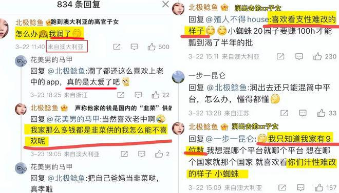
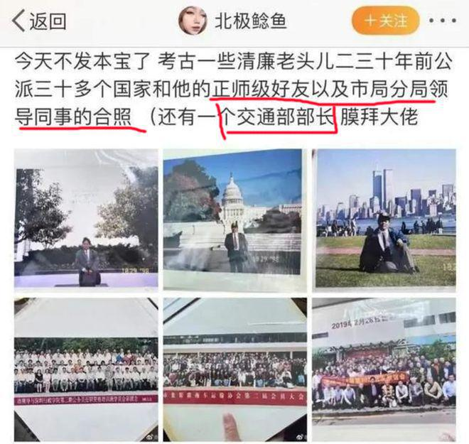
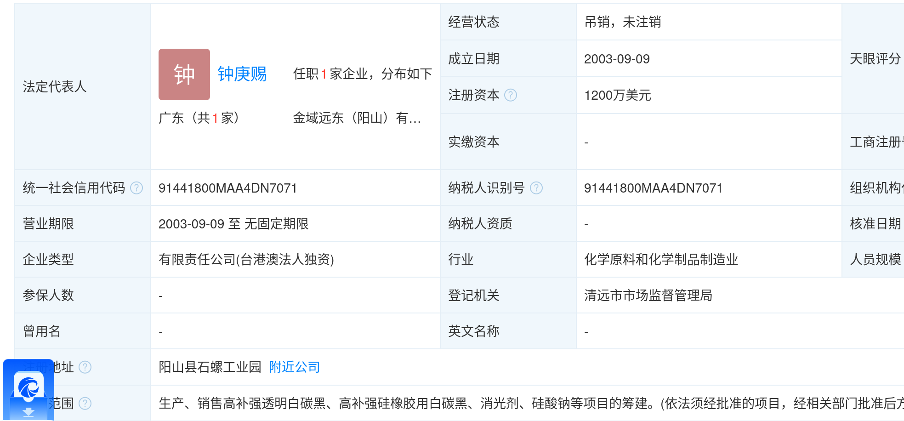

# [北极鲶鱼](https://zh.wikipedia.org/wiki/%E5%8C%97%E6%9E%81%E9%B2%B6%E9%B1%BC%E4%BA%8B%E4%BB%B6)

**北极鲶鱼事件**，2023年3月，因昵称“北极鲶鱼”的网友在社交平台上炫富、侮辱普通网民等而引发的网络事件。

## 简介

“北极鲶鱼”本名**钟淑卉**，广东省深圳市福田人，父亲**钟晓斌**，爷爷钟庚赐，曾任[深圳市](https://baike.baidu.com/item/深圳市/11044365?fromModule=lemma_inlink)交通局货运分局局长，已于2007年11月30日退休。

钟淑卉 身份证 44030420011029****

## 事件详情

2023年3月22日，账号昵称为“北极鲶鱼”的网友在微博平台发文称“怎么办，我润了”，IP地址显示为澳大利亚。随后，有网友跟评讽刺她出国后仍使用中国的APP是“太爱”中国了，她回复称家里的钱都是“韭菜供的”所以喜欢中国，并称家中存款有9位数，称质疑的网友为“小蜘蛛”、“枝性难改”。随后，在中国大陆社交媒体上引发热议。

在“北极鲶鱼”的账号下，因其炫富因产生的争议已存在多时。根据她分享的内容，其祖父曾是深圳官员，已退休十几年，曾公派三十多个国家，有正师级好友，

在2月6日贴文中称祖父先去桂林市扮渔夫卖鱼，之后便身穿西装公派美国纽约，好像脸上写上“感觉贪了”四个字。随后，有媒体报道称他祖父是深圳市交通局货运管理分局前局长钟庚赐。新浪微博在事件发酵后，迅速清空其贴文并封号。

2023年3月24日，钟庚赐回应中国新闻周刊，称家中有9位数的说法不实，表示自己2007年退休，曾任深圳区级交通局局长，“老老实实就这样干到退休”，目前相关单位正介入调查。

2023年3月24日，深圳市交通运输局发布情况通报，证实“北极鲶鱼”的祖父为该局原货运分局干部钟某某，且钟某某已于2007年11月30日退休，该局将就相关信息开展核查，将及时通报有关情况。

有媒体通过天眼查发现，[金域远东（阳山）有限公司](https://www.tianyancha.com/company/2952530425)法定代表人、董事长钟某赐与网友“北极鲶鱼”的爷爷同名，疑似上述事件当事人。该公司成立于2003年9月，注册资本1200万美元，由2001年3月成立的中国香港企业金域（远东）集团有限公司全资持股，后于钟某赐退休的2007年11月解散。

2023年4月25日，深圳市交通运输局向记者回应称，正在关注该事件，但调查仍没有结果。

2023年6月29日，深圳市交通运输局向记者回应称，深圳市纪委在对此事进行调查，暂无时间表，请耐心等待通告，而该局则已无调查权限。
